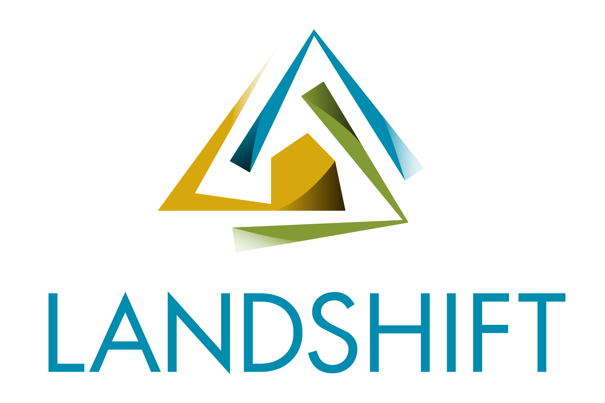

# LandShift repository
This is the repository of University of Geneva - Living Earth Lab for the Horizon-Europe [LandShift](https://landshift.eu) project .

	

## Contributor guidelines
Contributions are welcome and greatly appreciated! To contribute, please follow the following guidelines:

**Reporting issues**
* Check that the issue has not already been reported on the [issue tracker](https://github.com/ggiuliani/LivingEarthLab/issues).
* Submit an issue on the [issue tracker](https://github.com/ggiuliani/LivingEarthLab/issues).

**Development process**
* Fork the repository, make changes in your fork, and submit a pull request.
* Follow the existing coding style and structure.
* Write tests for any new functionality.
* Document any changes in the package documentation.

**Where to get help**
* Maintainer: [Gregory Giuliani](https://www.unige.ch/envirospace/people/giuliani)
